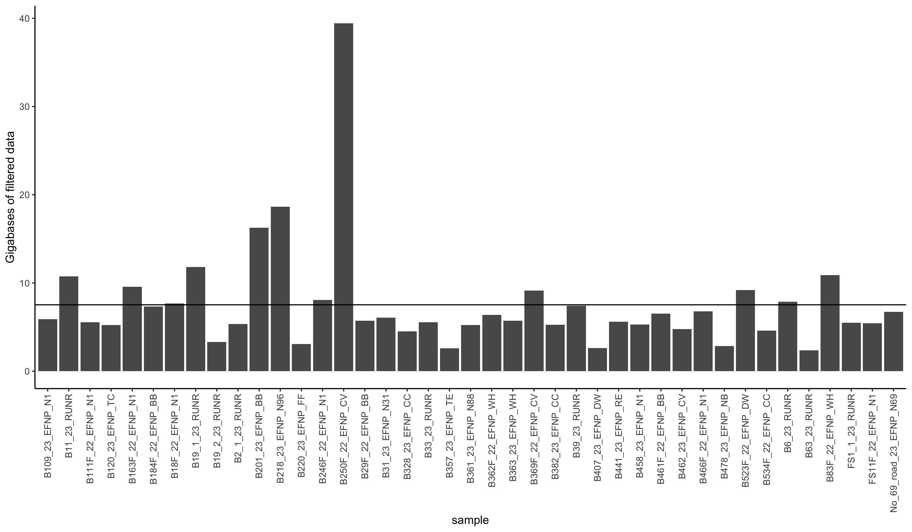
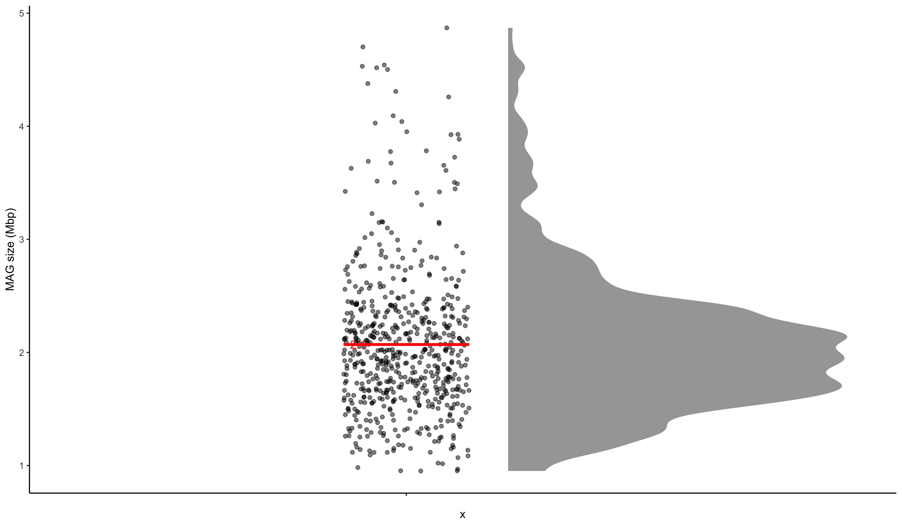

# NHNW_report
Raphael Eisenhofer

## Northern Hairy-nosed Wombat faecal metagenomics

This report contains data from only the NHNW samples.

## Preprocessing report

Here are the results for the preprocessing of the data, namely, fastp to
trim/quality filter the paired reads and the mapping of filtered reads
to the bare-nosed wombat genomes.

``` r
library(tidyverse)
library(scales)
library(ggtext)
library(ggforce)
library(ggdist)
library(patchwork)

ppr <- read_delim("../data/NHNW/preprocessing_report.tsv")

mean_gbp <- mean(ppr$bases_post_filt) / 1e9
mean_host <- mean(ppr$host_percentage)
max_host <- max(ppr$host_percentage)

ppr %>%
  ggplot(aes(y = bases_post_filt / 1000000000, x = sample)) +
  geom_histogram(stat = "identity") +
  geom_hline(yintercept = mean(ppr$bases_post_filt) / 1e9) +
  theme_classic() + 
  theme(
    axis.text.x = element_text(angle = 90, hjust = 1, vjust = 0.5)
  ) +
  ylab("Gigabases of filtered data")
```



Horizontal line indicates the mean (7.5) Gbp of data for the samples.
There was minimal mapping of reads to the host genome: max = 2% mean =
0.21%.

### Coassembly report

Here’s a summary of the coassembly and binning of all samples together.

``` r
coasb <- read_delim("../data/NHNW/nhnw_coassembly_summary.tsv")

nbin <- max(coasb$num_bins)
ncontig <- max(coasb$num_contigs)
total_length <- max(coasb$total_length / 1e9)
longest_contig <- max(coasb$largest_contig)
n50 <- max(coasb$N50)
coasb_mapping_mean <- percent(mean(coasb$assembly_mapping_percent/100), accuracy = 0.1)
coasb_mapping_max <- percent(max(coasb$assembly_mapping_percent/100), accuracy = 0.1)
coasb_mapping_min <- percent(min(coasb$assembly_mapping_percent/100), accuracy = 0.1)
```

Coassembly yielded 2.19412^{5} contigs with a total length of 1.8294628
Gbp. The longest contig was 8.16345^{5} bp, with an average N50 of
2.2118^{4} bp. Overall the coassembly captured most of the metagenomic
reads, with a mean mapping rate of 94.7% (max = 97.6%; min = 90.8%).
Binning of these contigs yielded 600 metagenome assembled genomes
(MAGs).

### Dereplication report

Here is the report on the dereplication of the MAGs at an average
nucleotide identity (ANI) of 98%. This is to help mitigate cross-mapping
between highly similar MAGs in the final table. **No MAGs were
dereplicated at this level.**

### Final MAG quality report

Here are some stats for the quality of the final MAGs.

``` r
mags <- read_delim("../data/NHNW/nhnw_metawrap_70_10_bins.stats")

comp <- mags %>% 
  ggplot(aes(y = completeness, x = "")) +
  stat_halfeye(
    adjust = .5,
    width = .6, 
    .width = 0, 
    justification = -.3, 
    point_colour = NA
  ) + 
  geom_point(
    size = 4,
    alpha = .3,
    position = position_jitter(seed = 1, width = .1)
  ) + 
  stat_summary(
    fun = "mean", 
    geom = "crossbar", 
    colour = "red", 
    width = 0.2
  ) +
  stat_summary(
    fun = "mean",
    geom = "text",
    aes(label = round(..y.., 2)),
    hjust = 2.5,
    colour = "red"
  ) +  
  theme_light() +
  theme(
    legend.box.background = element_rect(size = 0.5),
    legend.margin = margin(-5, 5, 0, 0),
    axis.title.x = element_blank(),
    legend.position = "none") +
  coord_cartesian(xlim = c(1.2, NA), clip = "off") +
  labs(y = "CheckM completeness")

cont <- mags %>% 
  ggplot(aes(y = contamination, x = "")) +
  stat_halfeye(
    adjust = .5,
    width = .6, 
    .width = 0, 
    justification = -.3, 
    point_colour = NA
  ) + 
  geom_point(
    size = 4,
    alpha = .3,
    position = position_jitter(seed = 1, width = .1)
  ) + 
  stat_summary(
    fun = "mean", 
    geom = "crossbar", 
    colour = "red", 
    width = 0.2,
  ) +
  stat_summary(
    fun = "mean",
    geom = "text",
    aes(label = round(..y.., 2)),
    hjust = 3,
    colour = "red"
  ) +  
  theme_light() +
  theme(
    legend.box.background = element_rect(size = 0.5),
    legend.margin = margin(-5, 5, 0, 0),
    axis.title.x = element_blank(),
    legend.position = "none") +
  coord_cartesian(xlim = c(1.2, NA), clip = "off") +
  labs(y = "CheckM contamination")

comp / cont
```


Most MAGs are of decent quality.

``` r
mags %>%
  ggplot(aes(x = "", y = size / 1000000)) +
  geom_jitter(width = 0.1, height = 0, alpha = 0.5) +
  stat_halfeye(
    adjust = .5,
    width = .6, 
    .width = 0, 
    justification = -.3, 
    point_colour = NA
  ) + 
  stat_summary(
    fun = "mean", 
    geom = "crossbar", 
    colour = "red", 
    width = 0.2,
  ) +
  stat_summary(
    fun = "mean",
    geom = "text",
    aes(label = number(mean(mags$size / 1000000), accuracy = 0.1)),
    hjust = 3.5,
    colour = "red"
  ) +  
  theme_classic() +
  ylab("MAG size (Mbp)")
```



The mean MAG size is 2.1 Mbp. This is pretty low, but cool, as it
suggests that most of these bacteria probably can’t live outside the
NHNW gut!

### How well did we capture the metagenomic samples?

Using \`SingleM microbial_fraction\`, we can estimate how much
prokaryotic DNA is in our metagenomes. We can then compare this to the
mapping rate to calculate a **D**omain-**A**djusted **M**apping **R**ate
(**DAMR**). This lets us know how well we’ve captured the prokaryotic
community using our assembly/binning. For more info, see our paper
describing the method:
<https://www.biorxiv.org/content/10.1101/2024.05.16.594470v1>

``` r
smf <- read_delim("../data/NHNW/smf_nhnw.tsv") %>%
  mutate(sample = str_replace_all(sample, "_M_1", ""))
mag_mapping <- read_delim("../data/NHNW/mag_mapping_rate.txt") %>%
  pivot_longer(., !Genome) %>%
  filter(Genome == "unmapped") %>%
    mutate(name = str_replace_all(name, " Relative Abundance \\(%\\)", ""),
           mapped = 100 - value) %>%
  inner_join(., smf, by = join_by(name == sample)) %>% 
  mutate(DAMR = mapped / as.numeric(read_fraction))

mag_mapping %>% 
  ggplot(aes(x = "", y = DAMR * 100)) +
  geom_jitter(width = 0.1, height = 0, alpha = 0.5) +
  stat_halfeye(
    adjust = .5,
    width = .6, 
    .width = 0, 
    justification = -.3, 
    point_colour = NA
  ) + 
  stat_summary(
    fun = "mean", 
    geom = "crossbar", 
    colour = "red", 
    width = 0.2,
  ) +
  stat_summary(
    fun = "mean",
    geom = "text",
    aes(label = number(mean(mag_mapping$DAMR * 100), accuracy = 0.1)),
    hjust = 3.5,
    colour = "red"
  ) +  
  theme_classic() +
  ylab("Domain-Adjusted Mapping Rate (%)")
```


Overall, we’ve captured most of the prokaryote DNA in the samples (mean
77.3%). This is pretty decent considering the complexity of these
microbial communities!
