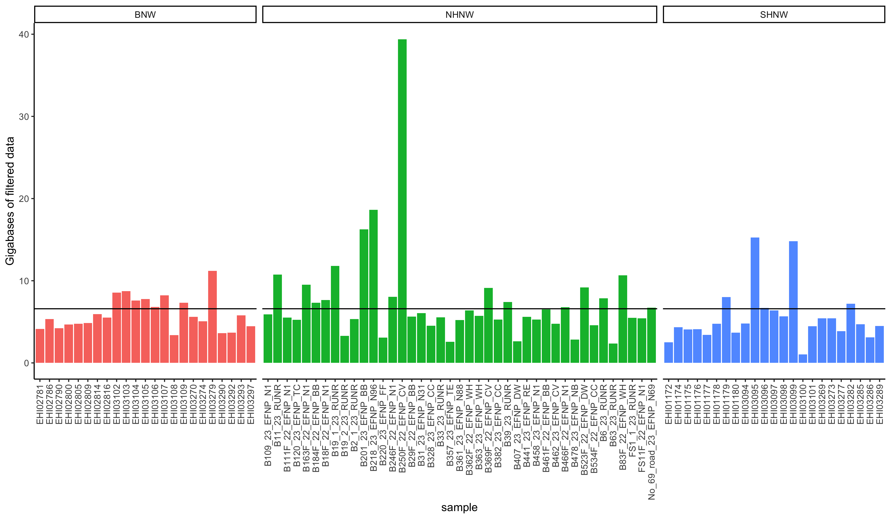
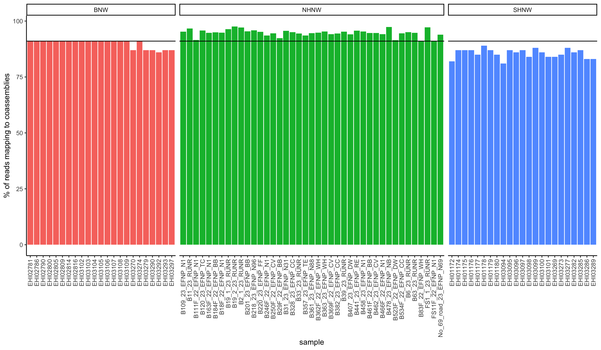
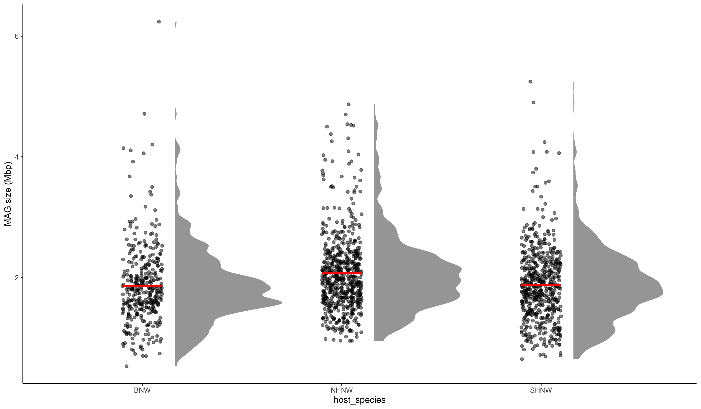

# All wombats data report
Raphael Eisenhofer

## Wombat “Trifecta” metagenomic data report

This report details the quality of the metagenomic data (from faecal
samples) for all three different wombat species:

- *Lasiorhinus latifrons* (Southern Hairy-nosed Wombat; ) \[**SHNW**\]

- *Lasiorhinus krefftii* (Northern Hairy-nosed Wombat; Yaminon)
  \[**NHNW**\]

- *Vombatus ursinus* (Bare-nosed Wombat) \[**BNW**\]

## Preprocessing report

Here are the results for the preprocessing of the data, namely, fastp to
trim/quality filter the paired reads and the mapping of filtered reads
to the bare-nosed wombat genomes. (*There are currently no hairy-nosed
wombat nuclear genomes as of 22/01/2025*).

``` r
library(tidyverse)
library(scales)
library(ggtext)
library(ggforce)
library(ggdist)
library(patchwork)

ppr <- read_delim("data/all_wombats/metadata.tsv") %>%
  select(EHI_plaintext, metagenomic_bases, species,
         host_bases, singlem_fraction,
         average_bacterial_archaeal_genome_size) %>%
  rename(sample = EHI_plaintext,
         average_genome_size = average_bacterial_archaeal_genome_size) %>%
  mutate(
    host_species = case_when(species == "Lasiorhinus latifrons" ~ "SHNW",
                             species == "Vombatus ursinus" ~ "BNW",
                             species == "Lasiorhinus kreffttii" ~ "NHNW"
                             ),
         host_percentage = host_bases / metagenomic_bases
         ) 


mean_gbp <- mean(ppr$metagenomic_bases) / 1e9
mean_host <- mean(ppr$host_percentage)
max_host <- max(ppr$host_percentage)

ppr %>%
  ggplot(aes(y = metagenomic_bases / 1000000000, 
             x = sample,
             fill = host_species)) +
  facet_grid(~host_species, scales = "free", space = "free") +
  geom_histogram(stat = "identity") +
  geom_hline(yintercept = mean(ppr$metagenomic_bases) / 1e9) +
  theme_classic() + 
  theme(
    axis.text.x = element_text(angle = 90, hjust = 1, vjust = 0.5),
    legend.position = "none"
  ) +
  ylab("Gigabases of filtered data")
```



Horizontal line indicates the mean 6.6 Gbp of data for the samples.
There was minimal mapping of reads to the host genome: max = 32% mean =
1.78%.

### Coassembly report

Here’s a summary of the coassembly and binning of all samples together
by host species.

``` r
coasb <- read_delim("data/all_wombats/AB_assembly_binning.csv") %>%
  select(EHI_number, num_bins, assembly_mapping_percent, Host) %>%
  rename(host_species = Host, sample = EHI_number) %>%
  mutate(host_species = str_replace(host_species, 
                                    "Lasiorhinus latifrons", 
                                    "SHNW"),
         host_species = str_replace(host_species, 
                                    "Vombatus ursinus", 
                                    "BNW"))

coasb_nhnw <- read_delim("data/NHNW/nhnw_coassembly_summary.tsv") %>%
  select(sample, num_bins, assembly_mapping_percent) %>%
  mutate(host_species = "NHNW")

coasb_merged <- coasb %>%
  bind_rows(., coasb_nhnw) %>%
  filter(num_bins > 0)


coasb_mapping_mean <- percent(mean(coasb_merged$assembly_mapping_percent/100), accuracy = 0.1)
coasb_mapping_max <- percent(max(coasb_merged$assembly_mapping_percent/100), accuracy = 0.1)
coasb_mapping_min <- percent(min(coasb_merged$assembly_mapping_percent/100), accuracy = 0.1)

coasb_merged %>%
  ggplot(aes(y = assembly_mapping_percent, 
             x = sample,
             fill = host_species)) +
  facet_grid(~host_species, scales = "free", space = "free") +
  geom_histogram(stat = "identity") +
  geom_hline(yintercept = mean(coasb_merged$assembly_mapping_percent)) +
  theme_classic() + 
  theme(
    axis.text.x = element_text(angle = 90, hjust = 1, vjust = 0.5),
    legend.position = "none"
  ) +
  ylab("% of reads mapping to coassemblies")
```



Overall the coassembly captured most of the metagenomic reads, with a
mean mapping rate of 91.0% (max = 97.6%; min = 81.0%). Binning of these
contigs yielded 600, 301, and 208 metagenome assembled genomes (MAGs)
for the NHNW, SHNW, and BNW, respectively. Keep in mind that the
microbial fractions may be different between species (more on this
later).

### Final MAG quality report

Here are some stats for the quality of the final MAGs.

``` r
shnw_mags <- read_delim("data/all_wombats/DMB0178_mag_info.tsv") %>%
  select(genome, completeness, contamination, mag_size) %>%
  mutate(host_species = "SHNW") 

bnw_mags <- read_delim("data/all_wombats/DMB0179_mag_info.tsv") %>%
  select(genome, completeness, contamination, mag_size) %>%
  mutate(host_species = "BNW")


nhnw_mags <- read_delim("data/NHNW/nhnw_metawrap_70_10_bins.stats") %>%
  select(bin, completeness, contamination, size) %>%
  rename(genome = bin, mag_size = size) %>%
  mutate(host_species = "NHNW")

mags <- shnw_mags %>%
  bind_rows(., nhnw_mags) %>%
  bind_rows(., bnw_mags) %>%
  filter(completeness >= 70)

comp <- mags %>% 
  ggplot(aes(y = completeness, x = host_species,
             fill = host_species)) +
  stat_halfeye(
    adjust = .5,
    width = .6, 
    .width = 0, 
    justification = -.3, 
    point_colour = NA
  ) + 
  geom_point(
    size = 2,
    alpha = .3,
    position = position_jitter(seed = 1, width = .1)
  ) + 
  stat_summary(
    fun = "mean", 
    geom = "crossbar", 
    colour = "red", 
    width = 0.2
  ) +
  stat_summary(
    fun = "mean",
    geom = "text",
    aes(label = round(..y.., 2)),
    hjust = 2.5,
    colour = "red"
  ) +  
  theme_light() +
  theme(
    legend.box.background = element_rect(size = 0.5),
    legend.margin = margin(-5, 5, 0, 0),
    axis.title.x = element_blank(),
    legend.position = "none") +
  coord_cartesian(xlim = c(1.2, NA), clip = "off") +
  labs(y = "CheckM completeness")

cont <- mags %>% 
  ggplot(aes(y = contamination, x = host_species,
             fill = host_species)) +
  stat_halfeye(
    adjust = .5,
    width = .6, 
    .width = 0, 
    justification = -.3, 
    point_colour = NA
  ) + 
  geom_point(
    size = 2,
    alpha = .3,
    position = position_jitter(seed = 1, width = .1)
  ) + 
  stat_summary(
    fun = "mean", 
    geom = "crossbar", 
    colour = "red", 
    width = 0.2,
  ) +
  stat_summary(
    fun = "mean",
    geom = "text",
    aes(label = round(..y.., 2)),
    hjust = 2.5,
    colour = "red"
  ) +  
  theme_light() +
  theme(
    legend.box.background = element_rect(size = 0.5),
    legend.margin = margin(-5, 5, 0, 0),
    axis.title.x = element_blank(),
    legend.position = "none") +
  coord_cartesian(xlim = c(1.2, NA), clip = "off") +
  labs(y = "CheckM contamination")

comp / cont
```


Most MAGs are of decent quality. Note that this is before dereplication
of all MAGs (host species) together.

``` r
mags %>%
  ggplot(aes(x = host_species, y = mag_size / 1000000)) +
  geom_jitter(width = 0.1, height = 0, alpha = 0.5) +
  stat_halfeye(
    adjust = .5,
    width = .6, 
    .width = 0, 
    justification = -.3, 
    point_colour = NA
  ) + 
  stat_summary(
    fun = "mean", 
    geom = "crossbar", 
    colour = "red", 
    width = 0.2,
  ) +  
  theme_classic() +
  ylab("MAG size (Mbp)")
```



The mean MAG size is ~2 Mbp. This is pretty low, but cool, as it
suggests that many of these bacteria probably can’t live outside the
wombat gut!

### How well did we capture the metagenomic samples?

Using \`SingleM microbial_fraction\`, we can estimate how much
prokaryotic DNA is in our metagenomes. We can then compare this to the
mapping rate to calculate a **D**omain-**A**djusted **M**apping **R**ate
(**DAMR**). This lets us know how well we’ve captured the prokaryotic
community using our assembly/binning. For more info, see our paper
describing the method:
<https://www.biorxiv.org/content/10.1101/2024.05.16.594470v1>

``` r
smf <- ppr %>%
  select(sample, singlem_fraction, host_species)

damr <- read_delim("data/all_wombats/mapping_rate.txt") %>%
  pivot_longer(., !Genome) %>%
  filter(Genome == "unmapped") %>% 
  mutate(name = str_replace_all(name, " Relative Abundance \\(%\\)", ""),
           mapped = 100 - value) %>% 
  inner_join(., smf, by = join_by(name == sample)) %>% 
  mutate(DAMR = mapped / as.numeric(singlem_fraction))


mean_damr <- percent(mean(damr$DAMR), accuracy = 0.1)

damr %>% 
  ggplot(aes(x = host_species, y = DAMR * 100, fill = host_species)) +
  geom_jitter(width = 0.1, height = 0, alpha = 0.5) +
  stat_halfeye(
    adjust = .5,
    width = .6, 
    .width = 0, 
    justification = -.3, 
    point_colour = NA
  ) + 
  stat_summary(
    fun = "mean", 
    geom = "crossbar", 
    colour = "red", 
    width = 0.2,
  ) +  
  theme_classic() +
  theme(legend.position = "none") +
  ylab("Domain-Adjusted Mapping Rate (%)")
```


Overall, we’ve captured a good amount of the prokaryote DNA in the
samples (mean 77.3%). This is pretty decent considering the complexity
of these microbial communities! Note that the BNW is on average lower
~64% compared to the HNWs ~82%.
