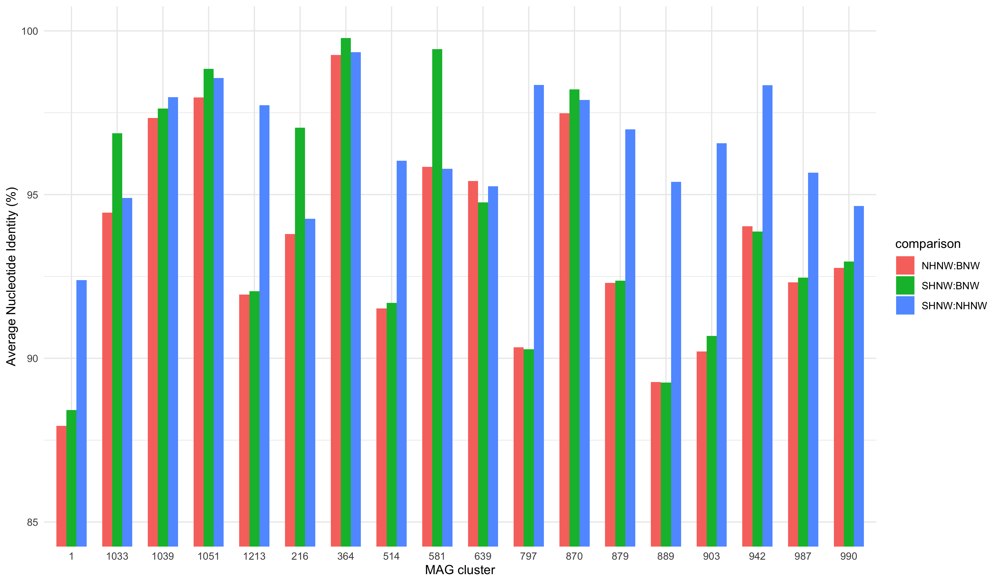
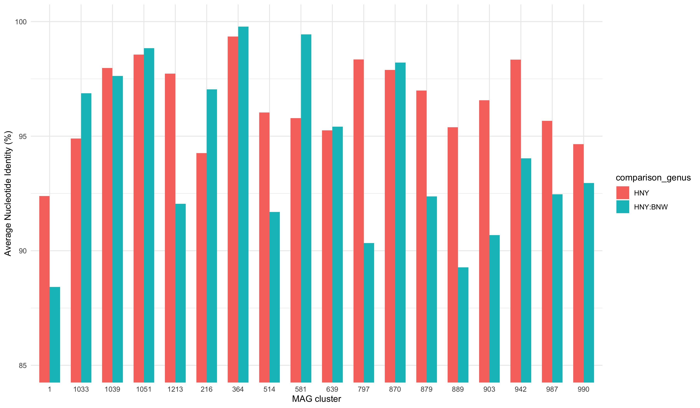

# Finding shared genomes
Raphael Eisenhofer

## Finding shared genomes

Foray into identifying bacterial species/genomes that are shared among
the three host species of wombats. *Vombatus ursinus* (bare-nosed
wombat; **BNW**) appears to share a common ancestor ~6-8 million years
ago (MYA) with *Lasiorhinus latifrons* (southern hairy-nosed wombat;
**SHNW**) \[Mitchell et al. 2014; dated mitochondrial tree\].
*Lasiorhinus krefftii* (northern hairy-nosed wombat; **NHNW**) is more
closer related to the **SHNW**, but I couldn’t find any published data
with date estimates \[Colin/Jeremy, do you have an estimate?\], but I’m
guessing that it’s \< 2 MYA.

Here I’ll use data from dRep: the dereplication of bacterial genomes
using MASH and ANImf to identify candidate bacterial genomes that show
signs (high ANI; average nucleotide identity) of being present at the
**TMRCA** (time to most recent common ancestor) for 1) all wombats, and
2) hairy-nosed wombats.

## Load packages & data

``` r
library(tidyverse)
library(ggplot2)

shnw_mags <- read_delim("data/all_wombats/DMB0178_mag_info.tsv") %>%
  select(genome, completeness, contamination, mag_size) %>%
  mutate(host_species = "SHNW") 

bnw_mags <- read_delim("data/all_wombats/DMB0179_mag_info.tsv") %>%
  select(genome, completeness, contamination, mag_size) %>%
  mutate(host_species = "BNW")

nhnw_mags <- read_delim("data/NHNW/nhnw_metawrap_70_10_bins.stats") %>%
  select(bin, completeness, contamination, size) %>%
  rename(genome = bin, mag_size = size) %>%
  mutate(host_species = "NHNW")

gtdb <- read_delim("data/all_wombats/gtdbtk_combined_summary.tsv") %>%
  rename(genome = user_genome) %>%
  mutate(genome = str_replace(genome, ".fa", "")) %>%
  select(genome, classification) %>%
  separate(
    col = classification, 
    into = c("domain", "phylum", "class", "order", 
             "family", "genus", "species"),
    sep = ";"
    )

mag_info <- shnw_mags %>%
  rbind(bnw_mags, nhnw_mags) %>%
  left_join(., gtdb, by = join_by(genome))

#contains high level clustering information for MAGs (MASH)
cdb <- read_delim("data/all_wombats/drep_data_tables/Cdb.csv") %>%
  mutate(genome = str_replace(genome, ".fa.gz", ""))

#contains pairwise ANI distances (fastANI) between clusters of MAGs
ndb <- read_delim("data/all_wombats/drep_data_tables/Ndb.csv") %>%
    mutate(
      reference = str_replace(reference, ".fa.gz", ""),
      querry = str_replace(querry, ".fa.gz", "")
           ) 

#filter out only genomes that have secondary clusters (MASH ANI > 90%)
cdb_counts <- cdb %>%
  add_count(primary_cluster, name = "n_primary_cluster_members") %>%
  add_count(secondary_cluster, name = "n_secondary_cluster_members")

cdb_filt <- cdb_counts %>%
  filter(n_primary_cluster_members > 1) 

#basic stats
n_primary_clusters <- length(unique(cdb$primary_cluster))
n_secondary_clusters <- length(unique(cdb$secondary_cluster))


#Combine into one df
mag_df <- mag_info %>%
  inner_join(., cdb_filt, by = join_by(genome)) 


hosts_across_clusters <- mag_df %>%
  summarise(n_species_cluster = n_distinct(host_species),
            n_primary_cluster_members = max(n_primary_cluster_members),
            n_secondary_cluster_members = max(n_secondary_cluster_members),
            n_secondary_cluster = n_distinct(secondary_cluster),
            mean_genome_size = mean(mag_size),
            .by = secondary_cluster)


n_cross_species <- hosts_across_clusters %>% 
  filter(n_secondary_cluster_members > 1 & n_species_cluster > 1) %>% 
  nrow()

n_cross_species <- hosts_across_clusters %>% 
  filter(n_primary_cluster_members > 1 & n_species_cluster > 1) %>% 
  nrow()


#comparisons we want to keep (basically removing same species comparisons as they are redundant, and duplicates, e.g. NHNW:SHNW == SHNW:NHNW)
comparison_vec <- c("SHNW:BNW", "NHNW:BNW", "SHNW:NHNW")

host_species_info <- mag_info %>%
  select(genome, host_species)

# ani_genomes <- ndb %>%
#   left_join(., mag_species, by = join_by(reference == genome)) %>%
#   rename(ref_species = host_species) %>%
#   left_join(., mag_species, by = join_by(querry == genome)) %>%
#   rename(query_species = host_species) %>%
#   unite(
#     col = comparison, 
#     ref_species, query_species, 
#     sep = ":",
#     remove = FALSE
#     ) %>%
#   mutate(
#     comparison = str_replace(comparison, "BNW:SHNW", "SHNW:BNW"),
#     comparison = str_replace(comparison, "BNW:NHNW", "NHNW:BNW"),
#     comparison = str_replace(comparison, "NHNW:SHNW", "SHNW:NHNW")
#     ) %>%
#   filter(comparison %in% comparison_vec)

ani_genomes <- ndb %>%
  left_join(., host_species_info, by = join_by(reference == genome)) %>%
  rename(ref_species = host_species) %>%
  left_join(., host_species_info, by = join_by(querry == genome)) %>%
  rename(query_species = host_species) %>%
  unite(
    col = comparison, 
    ref_species, query_species, 
    sep = ":",
    remove = FALSE
    ) %>%
  filter(comparison %in% comparison_vec) %>%
  #filter low alignment coverage comparisons
  filter(alignment_coverage > 0.5) %>%
  add_count(primary_cluster, name = "n_primary_cluster_members")
  
#For clusters with MAGs from all three species, are HNYs more similar than HNY:BNW?
all_three_species <- ani_genomes %>%
  filter(n_primary_cluster_members == 3) %>%
  left_join(., mag_info, by = join_by(reference == genome)) %>%
  mutate(comparison_genus = case_when(
    str_detect(comparison, "BNW") ~ "HNY:BNW",
    .default = "HNY")
    )

n_all_three_comparisons <- nrow(all_three_species) / 3

all_three_species %>% 
  summarise(mean_ani = mean(ani), .by = comparison)
```

    # A tibble: 3 × 2
      comparison mean_ani
      <chr>         <dbl>
    1 SHNW:BNW      0.943
    2 NHNW:BNW      0.936
    3 SHNW:NHNW     0.964

``` r
#make a plot showing this info (ID for future ref)
#also look at genome characteristics (e.g. taxonomy, size, gc, etc.)

all_three_species %>%
  ggplot(aes(
    x = as.character(primary_cluster), 
    y = ani * 100, 
    fill = comparison)
         ) +
  geom_col(position = "dodge", width = 0.66) +
  theme_minimal() +
  coord_cartesian(ylim = c(85, 100)) +
  labs(x = "MAG cluster", y = "Average Nucleotide Identity (%)")
```



``` r
all_three_species %>%
  ggplot(aes(
    x = as.character(primary_cluster), 
    y = ani * 100, 
    fill = comparison_genus)
         ) +
  geom_col(position = "dodge", width = 0.66) +
  theme_minimal() +
  coord_cartesian(ylim = c(85, 100)) +
  labs(x = "MAG cluster", y = "Average Nucleotide Identity (%)")
```



### Playing around

``` r
library(tidyverse)
library(ggdendro)
library(scales)
```


    Attaching package: 'scales'

    The following object is masked from 'package:purrr':

        discard

    The following object is masked from 'package:readr':

        col_factor

``` r
plot_MASH_dendrogram <- function(Mdb, Cdb, threshold = FALSE, plot_dir = NULL) {
  # Set ggplot theme
  theme_set(theme_minimal() +
            theme(panel.grid = element_blank(),
                  axis.line.x = element_line(),
                  axis.ticks.y = element_blank(),
                  plot.margin = margin(l = 100, r = 20)))
  
  # Convert to distance matrix
  dist_mat <- Mdb %>%
    select(genome1, genome2, dist) %>%
    pivot_wider(names_from = genome2, values_from = dist) %>%
    column_to_rownames("genome1") %>%
    as.matrix()
  
  # Make sure it's a proper distance matrix (symmetric with 0 diagonal)
  dist_mat <- as.dist(dist_mat)
  
  # Perform hierarchical clustering
  hc <- hclust(dist_mat, method = "average")
  
  # Prepare cluster assignments
  name2cluster <- Cdb %>% 
    select(genome, primary_cluster) %>% 
    deframe()
  
  # Generate colors
  name2color <- gen_color_dictionary(hc$labels, name2cluster)
  
  # Convert hclust to dendrogram
  dend <- as.dendrogram(hc)
  
  # Prepare dendrogram data for plotting
  dend_data <- dendro_data(dend)
  
  # Prepare segment data
  segment_data <- segment(dend_data) %>%
    mutate(yend = ifelse(yend < 0, 0, yend))  # Ensure no negative values
  
  # Prepare label data with colors and clusters
  label_data <- label(dend_data) %>%
    mutate(color = unname(name2color),
           # Add secondary cluster info
           label_with_cluster = paste0(label, " (", 
                                      Cdb$secondary_cluster[match(label, Cdb$genome)], ")"))
  
  # Create the dendrogram plot
  p <- ggplot() +
    geom_segment(data = segment_data, 
                 aes(x = x, y = y, xend = xend, yend = yend)) +
    geom_text(data = label_data,
              aes(x = x, y = -0.01, label = label_with_cluster, color = color),
              hjust = 0, size = 3) +
    scale_y_reverse(expand = expansion(mult = c(0.1, 0.1)),
                   labels = function(x) sprintf("%.2f", (1 - x) * 100)) +
    scale_x_continuous(expand = expansion(mult = c(0.05, 0.05))) +
    scale_color_identity() +
    labs(title = "MASH clustering",
         x = "MASH Average Nucleotide Identity (ANI)",
         y = "") +
    coord_flip() +
    theme(axis.text.y = element_blank(),
          axis.text.x = element_text(size = 8),
          axis.title.x = element_text(size = 10, margin = margin(t = 10)))
  
  # Add threshold line if specified
  if (!isFALSE(threshold)) {
    p <- p + geom_hline(yintercept = threshold, linetype = "dashed")
  }
  
  # Adjust plot size based on number of labels
  n_labels <- length(hc$labels)
  plot_height <- max(6, n_labels * 0.3)  # Minimum height of 6 inches
  
  # Save or display the plot
  if (!is.null(plot_dir)) {
    ggsave(file.path(plot_dir, "Primary_clustering_dendrogram.pdf"), 
           p, width = 10, height = plot_height, 
           device = "pdf", bg = "transparent")
  }
  
  print(p)
  return(invisible(p))
}

# Helper function to generate colors
gen_color_dictionary <- function(names, name2cluster) {
  clusters <- unique(name2cluster[names])
  n_clusters <- length(clusters)
  
  # Use a color palette that works well for clusters
  if (n_clusters <= 8) {
    pal <- RColorBrewer::brewer.pal(max(3, n_clusters), "Set2")
  } else if (n_clusters <= 12) {
    pal <- RColorBrewer::brewer.pal(n_clusters, "Set3")
  } else {
    pal <- scales::hue_pal()(n_clusters)
  }
  
  colors <- setNames(pal[1:n_clusters], clusters)
  return(colors[as.character(name2cluster[names])])
}
```
